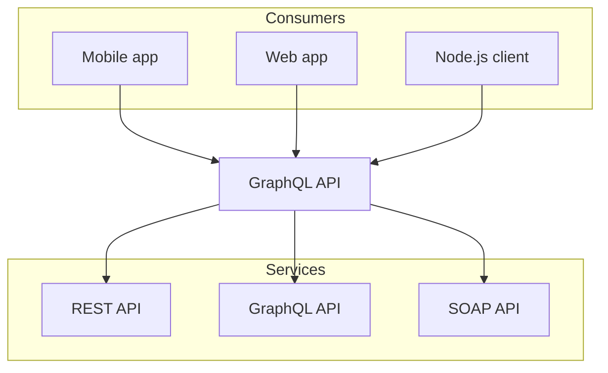

# Nextra Authoring Guide

Everything you need to know to add or edit documentation in this repository.

The guide assumes **no prior experience with Nextra**—the static-site framework we use to render Markdown (& MDX) into the docs website.

---

## 1&nbsp;· Project layout

```text
src/
└─ content/            ← All documentation lives here
   ├─ _meta.ts         ← Sidebar / navigation for the top level
   ├─ getting-started/
   │  ├─ _meta.ts      ← Navigation for this folder only
   │  ├─ index.mdx     ← Landing page (URL: /getting-started)
   │  └─ installation.mdx
   └─ reference/
      ├─ _meta.ts
      └─ api.mdx
```

Quick rules:

1. **Everything inside `src/content` is public.** The folder structure becomes the URL structure.
2. One **`_meta.ts` file per folder** describes how that folder shows up in the sidebar. (See section 5.)
3. Markdown/MDX files control the actual content that is rendered.

---

## 2&nbsp;· Creating pages

1. **Choose a location** inside `src/content`. Create new folders freely—Nextra will pick them up automatically.
2. **Name the file** in kebab-case: `vector-stores.mdx`, `quick-start.mdx`, …
3. Add **front-matter** (YAML between `---`) at the very top:

```mdx
---
title: "Installing Locally"
description: Get the project running on your machine in&nbsp;2 minutes.
---

# Installing Locally

…content…
```

Why it matters:

• `title` → `<title>` tag in the browser and Open Graph cards.
• `description` → meta description for search engines & social sharing.

> The build fails if a document has **no** front-matter—so always include it.

### Canonical filenames

• `index.mdx` – the landing page of a folder (e.g. `/guide`).
• `overview.mdx` – a secondary landing when `index.mdx` already exists at a higher level.

### Folder index without renaming the file

Sometimes you want a folder **and** an index page, but naming the file `index.mdx` doesn’t feel descriptive enough.  
Add `asIndexPage: true` to the front-matter instead:

```mdx
---
title: "All Fruits"
asIndexPage: true
---

# All Fruits

…
```

The MDX file can now have any name (e.g. `fruits.mdx`), yet it will be served at `/fruits` and expand the folder in the sidebar.

### 2.1 · Front-matter reference

Front-matter drives both SEO and how the page behaves at runtime.  
Common keys (all optional except `title`):

| Key           | Type      | Purpose / Example |
|---------------|-----------|-------------------|
| `title`       | string    | Human-readable H1 & browser title.<br>`"Vector Stores"` |
| `description` | string    | Meta description (≤ 160 chars). |
| `toc`         | boolean   | Show page table-of-contents.<br>`false` hides the TOC. |
| `tocDepth`    | number    | Max heading depth in TOC (default = 3). |
| `draft`       | boolean   | `true` → page will **not** be built/deployed. |
| `tag`         | string[]  | Page-level badges (`["beta", "experimental"]`). |
| `slug`        | string    | Override URL: `/custom-slug`. |
| `sidebarTitle` | string    | Overrides how the page appears in the sidebar. |
| `asIndexPage` | boolean   | Marks this MDX file as the **index page of its folder** without requiring the file to be named `index.mdx`. Useful when the folder also contains other pages. |

You rarely need more than `title` + `description`; the others are there when you need precise control.

> **Sidebar naming precedence**  
> 1. A non-empty label from `_meta.ts`  
> 2. `sidebarTitle` in the front-matter  
> 3. `title` in the front-matter  
> 4. The first `# H1` heading  
> 5. Automatically inferred from the filename

---

## 3&nbsp;· Writing Markdown/MDX

Headings
```
# H1   ← exactly **one** per file (should match the front-matter title)
## H2
### H3
```

Do not skip levels (e.g. `##` straight to `####`).

Code blocks

```ts filename="src/agents/weather.ts" showLineNumbers copy
import { Agent } from "@/core/agent";
// …
```

The three optional flags are recognised by our MDX components:

• `filename`   – displays a coloured header with the file path.
• `showLineNumbers` – adds line numbers.
• `copy`       – renders a copy-to-clipboard button.

Reusable components

| Component   | Import from             | When to use                        |
|-------------|-------------------------|------------------------------------|
| `Callout`   | `nextra/components`     | Notes, warnings, tips              |
| `Steps`     | `nextra/components`     | Multi-step walkthroughs            |
| `Tabs`      | `nextra/components`     | Code samples in several languages  |
| `Tag`       | `@/components/tag`      | “beta”, “new”, _etc._ in nav/menu  |
| `Table`     | `nextra/components`     | Styled wrapper for HTML `<table>`  |
| `Mermaid`   | `nextra/components`     | Programmatic diagrams (rarely needed) |

Cheat-sheet — you can embed a component inline like so:

```mdx
import { Callout, Tabs, Tab } from "nextra/components";

<Callout type="info">Short hint.</Callout>

<Tabs>
  <Tab title="npm">
    ```bash
    npm install your-package
    ```
  </Tab>
  <Tab title="pnpm">
    ```bash
    pnpm add your-package
    ```
  </Tab>
</Tabs>
```

Nextra ships with sensible defaults, so components need little to no styling on your side.

Feel free to make new React components in `src/components` if something is used more than once.

### 3.1 · Mermaid diagrams

Nextra ships with [Mermaid](https://mermaid.js.org/) support out of the box via the `@theguild/remark-mermaid` plugin.  
That means **any fenced code block whose language is `mermaid` is automatically rendered as a diagram**—no extra imports necessary.

Example – copy & paste into any `.mdx` file:



The raw Markdown above will be replaced by the `<Mermaid>` React component at build-time and rendered as an SVG.

Tips:

• Put the diagram **source** directly in the document so it is version controlled and searchable.  
• To adjust the diagram theme, override the CSS variable `--mermaid-theme` in `globals.css`.

If you ever need manual control, you can import the component yourself:

```mdx
import { Mermaid } from "nextra/components";

<Mermaid chart={"graph TD; A-->B"} />
```

…but 99 % of the time the fenced code block is simpler and preferred.

### 3.2 · Tables

There are **two** ways to create tables in MDX:

1. GitHub-Flavoured Markdown (GFM) table syntax – preferred.
2. Literal HTML (`<table><tr>…`) – only recommended when you need complex markup.

#### 1) GFM syntax (recommended)

```mdx
| left   | center | right |
| :----- | :----: | ----: |
| foo    |  bar   |   baz |
| banana | apple  |  kiwi |
```

renders as a nicely styled table:

| left   | center | right |
| :----- | :----: | ----: |
| foo    |  bar   |   baz |
| banana | apple  |  kiwi |

The pipes/colons control alignment—same syntax you know from GitHub READMEs.

#### 2) Literal HTML (unstyled by default)

If you drop raw HTML like this:

```html
<table>
  <tr><td>foo</td><td>bar</td></tr>
</table>
```

the result has **no styling** because MDX does _not_ automatically map HTML tags to our themed components.

##### Quick fix: use the built-in `<Table>` component

```mdx
import { Table } from "nextra/components";

<Table>
  <thead>
    <tr><th>Foo</th><th>Bar</th></tr>
  </thead>
  <tbody>
    <tr><td>a</td><td>b</td></tr>
  </tbody>
</Table>
```

##### Full control: opt-in via `whiteListTagsStyling`

If you really want to keep “plain” HTML but have it styled automatically, tell Nextra which tags to replace by updating `next.config.mjs`:

```js title="next.config.mjs"
import nextra from "nextra";

const withNextra = nextra({
  whiteListTagsStyling: ["table", "thead", "tbody", "tr", "th", "td"],
});

export default withNextra();
```

Those tags will now be passed through `useMDXComponents()` and pick up the same default styles as `<Table>`.

---

## 4&nbsp;· Internal links & assets

Links

• Prefer **absolute paths** (`/reference/agents/generate`)—safer when files move.
• Within the same folder a relative link (`./retrieval.mdx`) is acceptable.

Images & media

1. Place assets in `public/`—they are served verbatim at the root (`/diagram.png`).
2. Use short, kebab-case filenames.
3. Always provide meaningful `alt` text.

---

## 5&nbsp;· Sidebar order – `_meta.ts`

`_meta.ts` (or `_meta.tsx`) lives **inside the folder** it describes.

```ts
// src/content/reference/_meta.ts
import { Tag } from "@/components/tag";

const meta = {
  index: "Overview",              // file → display label
  agents: {                       // folder → group config
    title: "Agents",
    collapsed: false,
    order: 1,                     // lower numbers appear first (optional)
  },
  "speech-api": <Tag text="new">Speech API</Tag>,  // Rich label with JSX
};

export default meta;
```

Rules of thumb:

1. **Keys** = file or folder names **without** the extension.
2. **Values**
   • `string`               → simple label.
   • `{ title, …options }`  → section title plus options (`collapsed`, `order`, …).

`order` is numeric—lower numbers float to the top of the sidebar. If omitted, items fall back to the order they appear in the file.
   • `ReactElement`         → advanced; useful for badges.

If a file or folder is **not present** in `_meta.ts`, it appears at the bottom of the sidebar, ordered alphabetically.

### 5.1 · Advanced `_meta` options

Nextra allows several **special item types** that extend what you can do directly from `_meta.ts`:

| Task / feature        | Example snippet | Notes |
|-----------------------|-----------------|-------|
| External link         | `{ title: 'GitHub', href: 'https://github.com' }` | `href` supports absolute or relative URLs. |
| Visual separator      | `{ type: 'separator', title: 'Utilities' }` | Title is optional; creates a grey horizontal rule in the sidebar. |
| Dropdown / menu       | `{ type: 'menu', title: 'Company', items: { about: { href: '/about' } } }` | `items` follows the same rules as the top-level object. |
| Folder-wide fallback  | `'*': { type: 'page' }` | Applies this configuration to **all** items in the folder that do not have their own entry. |

#### Global `_meta` file

If you prefer a single source of truth, create `_meta.global.ts` (or `.tsx`) at `src/content/`.  Its structure is the same, with one caveat: when you list a **folder** you must include an `items` object that enumerates its children.

```ts
// src/content/_meta.global.ts
export default {
  index: 'Overview',
  docs: {
    title: 'Docs',
    items: {
      index: 'Introduction',
      guide: { title: 'Guide', collapsed: false },
    },
  },
};
```

A global file avoids walking the filesystem at runtime, but generates larger diffs—choose whatever style your team prefers.

---

## 6&nbsp;· Creating sub-folders (nested sections)

1. Inside `src/content`, make a new folder, e.g. `how-tos/`.
2. Add `how-tos/_meta.ts` to configure that section.
3. Put an `index.mdx` (or `overview.mdx`) inside for the landing page.
4. Add further `.mdx` files or even deeper sub-folders—each with its own `_meta.ts` when you need custom ordering.

Example:

```text
src/content/
└─ how-tos/
   ├─ _meta.ts
   ├─ index.mdx
   ├─ image-generation.mdx
   └─ data-import/
      ├─ _meta.ts
      ├─ index.mdx
      └─ csv.mdx
```

---

## 7&nbsp;· Linting & preview

Run:

```bash
pnpm dev   # local preview at http://localhost:3000
pnpm lint  # static-analysis for TypeScript/React/MDX
```

Open a pull request only when both commands pass.

---

## 8&nbsp;· Pull request checklist

✅ Correct folder and `_meta.ts` updated.
✅ Front-matter present.
✅ Exactly **one** `# H1` per file.
✅ No line longer than ~120 characters outside code blocks.
✅ The site builds (`pnpm build`) and looks right locally.

Happy writing! ✨
